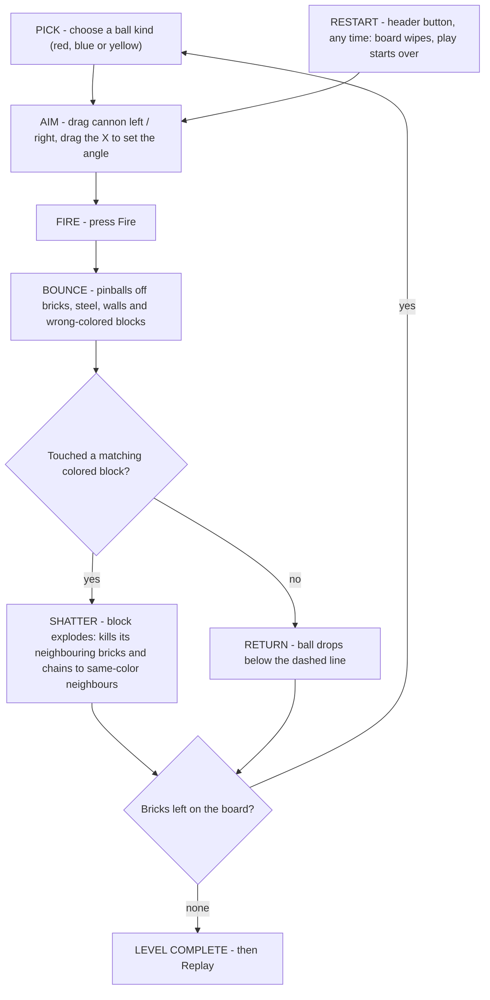

# Gameplay Design — *Block Breaker*

**One-line pitch:** A one-finger bank-shot puzzle. You fire balls into a wall of blocks — but the ball never breaks a brick itself. It must hit a *colored* block, which explodes, taking the light-gray bricks around it with it and setting off same-color chain reactions. Clear every brick and the level is done.

**Why it works:** a 60–90 second session, one hand, instantly readable, deliberately pressure-free — you can always keep shooting, so nobody is ever blocked, and mastery shows up as how few shots it took.

**Authority:** this document is authoritative for *rules, controls, state and level content*. `scene_structure.md` is authoritative for *hierarchy, coordinates and rendering* and has been updated to match this document; `repo_layout.md` is authoritative for file and class names. The nine decisions in §9 are **locked**; two level-composition items remain **open** (§6).

---

## 1. What is on screen

Everything in the mockup maps to exactly one of eight objects:

| Object | Looks like | What it does | Destroyable? |
|---|---|---|---|
| **Brick** | Light-gray rounded square | The objective. Purely a wall: balls bounce off it | Yes — only by a colored block's explosion |
| **Colored block** | Red / blue / yellow square | The explosive. Detonated by a matching ball | Yes — ball or another explosion |
| **Steel** | Gray square with an ✕ | Permanent obstacle that shapes shots (bank shots) | **Never** |
| **Cannon** | Bottom, metal nozzle | Moves left/right along the bottom rail; aims; holds the loaded ball | No |
| **Ball** | White (wildcard) or red/blue/yellow | Flies, bounces, detonates matching blocks | Used up per shot, then the cannon reloads |
| **Aiming mark** | The ✕ reticle floating in the field | Drag it to rotate the cannon | No |
| **Return line** | Dashed line across the bottom | The ball disappearing below it ends the shot | No |
| **Comet trail** | Glowing tail attached to the ball | Shows where the ball *has* been, over its last 5 bounces — never where it will go | No |

---

## 2. The core loop



There is no fail branch: the level can only end in a win. Nothing interrupts play except the player's own restart.

---

## 3. The rules (numbered so we can all reference them)

**Shooting**
1. **One ball at a time.** The player fires a single ball and only gets to fire again once the shot is resolved.
2. **The ball never breaks a brick.** Balls bounce off bricks, steel, walls and off-colored blocks. The ball is not a wrecking ball — it is a delivery mechanism.
3. **The shot ends** either when the ball detonates a block, or when it crosses the dashed line at the bottom. Either way the cannon is immediately ready again, still loaded with the same ball kind until the player picks a different one.
4. **Balls never slow down or fall.** Constant speed, no gravity, until they exit through the bottom. The angle is clamped so nobody can fire sideways or downwards.
5. **The player picks the ball kind freely.** Every kind that is on the board is always available — nothing counts down, nothing runs out, and there is no order the player is forced to follow.

**Destroying blocks**
6. **A colored block dies only to a matching ball** — a blue ball kills blue, a red ball kills red. A **white ball kills any color** (wildcard).
7. **A wrong-colored ball bounces off a colored block** like it was concrete. Un-popped blocks of other colors are obstacles, not targets — that is the puzzle.
8. **Every destroyed colored block explodes** and shatters every brick touching it, corners included (the full 3×3 ring around it).
9. **Chain reaction:** if a destroyed colored block touches a block **of the same color**, that one explodes too, shattering *its* neighbours, and so on. The chain stops at steel, bricks, empty space or a different color.
10. **Steel is forever.** It never breaks, and it blocks both balls and chains.

**Connectivity, stated once so the rules and the tools agree:** explosions and chains are **8-way** — corners count. Ball *access* is **4-way** — blocks are full-cell colliders, so two blocks meeting at a corner leave no gap a ball can pass through. The validator in §6 enforces exactly these two, and the level is authored against them.

**Ending the level**
11. **Win the moment the last brick shatters.** Colored blocks and steel may still be standing.
12. **There is no fail state.** A player can keep solving at their own pace until the board is clear.
13. **Restart** (the ↻ button) puts the level back to its starting state — full board, play starts over. Free, unlimited, no confirmation dialog.

### Chain reaction in pictures

Before — a red ball comes in and hits the left red block:

```
row3 (top):   B   B   B   B   B
row2 (mid):   B   R   R   B   .
row1 (bot):   B   B   B   .   .
```

After — one ball, **six bricks gone**, because the two reds were neighbours:

```
row3 (top):   B   .   .   B   B
row2 (mid):   .   .   .   .   .
row1 (bot):   B   .   .   .   .
```

Swap either red for a blue, and the chain stops at two bricks instead of six.

---

## 4. Aiming, controls and the comet trail

### Controls

| Player action | What happens |
|---|---|
| Tap a ball kind in the picker | Loads that kind into the cannon (see §5) |
| Drag the cannon left / right | Cannon slides along its rail (clamped to the arena; the mockup's side arrows hint at this axis) |
| Drag the ✕ mark | Cannon rotates toward it — the ✕ is the aim, not a target reticle |
| Touch anywhere in the field | The ✕ jumps to the finger and follows it, so the game is playable with one hand |
| Press **Fire** | Fires the loaded ball |
| Tap during a shot | Fast-forward the ball to 2× so nobody has to wait |
| Press **Restart** (↻, header) | Wipes the board and starts the level over instantly |

Input is **locked while a ball is in flight** (only pause, fast-forward and restart stay live).

Releasing an aim drag **never** fires — firing is the Fire button only. That is what keeps the cannon's rail drag and the ✕ aim drag two independent gestures.

### Comet trail — exact specification

| Property | Spec |
|---|---|
| Look | A glowing tail attached to the ball, brightest at the ball and fading to nothing at its far end — exactly like a comet |
| Length | **At most the last 5 bounces.** A "bounce" is one straight run of the ball |
| Behaviour past 5 | On the 6th bounce the oldest run fades out (~0.25 s) and stops being drawn. The trail never exceeds 5 runs |
| Ball life | Display-only cap. The ball itself keeps bouncing for as long as it takes to hit something or leave the field |
| Colour | The trail takes the ball's colour (white ball → white trail) |
| After the shot | The tail dissipates within about a second of the shot ending, leaving a clean board |
| Preview | **None.** Nothing is ever drawn ahead of the ball — no dots, no reflected path, no predicted bounces. Aiming is done with the ✕ alone |
| Sorting | Trail draws above blocks and beneath the ball, matching the existing render order |

A 5-run cap also bounds the trail's geometry, so cost stays flat and predictable on mobile no matter how long a shot ricochets.

---

## 5. Ball kinds, the header legend and the picker

**The header icons are a legend, not a supply.** They list the ball kinds this board uses — red, blue and yellow — so the player knows at a glance which colours matter. They never deplete, never reorder, and never count anything down.

**The player chooses what to fire.** Since there is no order to follow, the cannon needs a way to load a chosen kind:

- A compact **ball picker** sits with the cannon (recommendation: a small tray beside the Fire button). Tapping a kind loads it; the chosen kind glows and appears as the loaded ball at the muzzle.
- The previously chosen kind stays loaded, so repeat shots of the same colour need no extra tap.
- **Nothing runs out.** Every kind is available on every shot, which is what keeps the game pressure-free and guarantees the player can never be stranded on the wrong colour.

**On this board:** three kinds — red, blue and yellow, exactly the three icons the mockup shows. The **white wildcard ball is not used in this level**; it would appear as a fourth kind (in the header legend *and* in the picker) when a level uses it.

**What replaces the cycle as the puzzle:** the wall itself. As bricks are destroyed, the cells they occupied become open, which is the only way to reach the upper bands of the board (§6). So the order of play is still a real decision — it comes from the board unfolding, not from the ball supply.

---

## 6. The level (the only one, for now)

One level, authored to read like the mockup: same footprint, same mixed wall texture, same steel-heavy edges, same three icons in the header.

**Identity:** `Level_01` — the header label reads **LEVEL 1** (a single text field; the mockup's "24" is simply how its build was labelled).

### Structure

| Property | Value |
|---|---|
| Footprint | **10 columns × 13 rows** (130 cells), top-anchored, identical to the mockup |
| Composition | ~40 bricks · 13 colored blocks (3 red, 5 blue, 5 yellow) · ~40 steel · ~35 empty |
| Ball kinds | Red, blue, yellow — all selectable at all times |
| Landing lane | The bottom two rows are open: the ball travels and banks there before returning |
| Target zones | **12 detonation zones of 3×3**, arranged 3 across × 4 up. Every zone centres on a colored block, so **every brick on the board sits inside some block's 3×3 ring** — which is what makes the board fully clearable |
| Chain pairs | Two same-color pairs sit side by side, each wiping two zones' worth of bricks in a single shot |
| Par | ~10 shots (40 bricks ÷ roughly 4 bricks per detonation). A first completion typically takes 15–20 |

### Zone lattice — how coverage is obtained for free

12 zones = 3 across × 4 up, each a 3×3 ring. 3×3 = 9 of the 10 columns and 4×3 = 12 of the 13 rows are coverable, so the grid resolves into exactly one brick-free column plus the two-row landing lane:

```
col:       0  1  2  3  4  5  6  7  8  9
row 12:    #  C  #  ·  #  C  #  #  C  #     # = brick / steel / crack
row 11:    #  #  #  ·  #  #  #  #  #  #     C = coloured detonator (zone centre)
row 10:    #  #  #  ·  #  #  #  #  #  #     · = col 3 spine — always open
row  9:    #  #  #  ·  #  C  #  #  C  #     L = landing lane — rows 0–1, open
row  8:    #  #  #  ·  #  #  #  #  #  #
row  7:    #  #  #  ·  #  #  #  #  #  #
row  6:    #  C  #  ·  #  C  #  #  C  #
row  5:    #  #  #  ·  #  #  #  #  #  #
row  4:    #  #  #  ·  #  #  #  #  #  #
row  3:    #  C  #  ·  #  C  #  #  C  #
row  2:    #  #  #  ·  #  #  #  #  #  #
row  1:    L  L  L  L  L  L  L  L  L  L
row  0:    L  L  L  L  L  L  L  L  L  L
```

With centres at columns {1,5,8} × rows {3,6,9,12}, the rings cover columns 0–2 / 4–6 / 7–9 and rows 2–13, so **every `#` cell is inside some ring by construction** — coverage stops being something you check and becomes something the layout guarantees. Column 3 falls out as the vertical access spine, and the "narrow cracks" above are just the 1-cell stubs that branch from the spine to any coloured block it does not already touch.

### Open items (need sign-off)

1. **Composition vs. the floor rules.** The structure table asks for ~40 bricks / ~40 steel / ~35 empty on 130 cells, but the landing lane (20) + spine (13) already spend 33 of those 35 empties, leaving ~4 for the cracks that access requires — while reaching all 12 centres through 4-way open cells costs roughly 16–27 more. Recommended reading: treat those counts as pre-validation estimates and let the validator drive the final mix, i.e. the "~25% open" figure measures the wall above the lane, not the whole board. Expected landing zone: ~33 bricks / 13 coloured / ~34 steel / ~50 empty — visually safe, because the mockup already shows faint slot outlines in its empty cells. **Report the final mix when `Level_01` is authored.**
2. **Two same-color chain pairs.** 12 zones need 12 distinct centres, which leaves exactly one spare coloured block — so a rigid lattice can host only one adjacent same-color pair (centres are ≥3 apart). Recommended fix: shift 2 centres one cell off-lattice to create the second pair, and fill the small coverage loss with **steel**, which needs no coverage. Alternative: go to 14 coloured blocks. **Not yet applied.**

### Floor: two rules every level must satisfy

Found while laying out this board, and the reason the mockup cannot be copied cell-for-cell:

1. **Coverage** — every brick must sit inside some colored block's 3×3 ring. In the mockup, bricks are packed everywhere with only a handful of colored blocks buried among them; with balls that bounce instead of break, a brick outside every ring can never be destroyed, so the level can never be completed.
2. **Access** — every colored block must touch an open cell that connects back to the landing lane, or be same-color-adjacent to a block that does. A block sealed behind bricks or steel can never be hit, so its whole zone becomes dead bricks.

Applied literally, the mockup's density leaves dozens of unreachable blocks and unbreakable bricks. This level therefore keeps the mockup's footprint, colour mix, steel-heavy edges and header, and **adds narrow cracks** — one-cell-wide passages that thread from the landing lane up into the wall, touching each colored block in turn. That is also why the board is slightly airier than the mockup (about 25% open cells versus roughly 12%) and carries a few more colored blocks: both changes exist to satisfy coverage and access.

### Checks before this level ships

| Check | How |
|---|---|
| Coverage (every brick destroyable) | `Board/LevelValidator` (pure, no Editor deps) + `Editor/LevelValidatorWindow` — rejects the level if any brick sits outside all rings |
| Access (every block touchable, directly or by chain) | the same validator, on the **4-way** empty-cell network, with the 8-way same-color fallback |
| Order and par (the board really does unfold, and ~10 shots is achievable) | Playtest now; an automated shot solver is a later tool |
| Regression — the shipped map stays valid | EditMode test pins `Level_01` plus 3 deliberately-broken fixtures the validator must reject |

---

## 7. Winning and restarting

| Event | Player experience |
|---|---|
| **Win** | Remaining decorations fade, the popup shows **Level Complete**, and offers **Replay** |
| **Restart** (↻) | Instant, free, unlimited, both in the header and in the pause menu |
| **Pause** | Settings, sound, and the same one-tap restart as the header |

---

## 8. HUD specification (mapped to the mockup)

| Region | Element | Behaviour |
|---|---|---|
| Top-left | Gear | Opens pause/settings |
| Top-centre | "LEVEL 1" | Level label (one text field) |
| Below title | 3 ball icons + dashes | **Static legend** of the ball kinds on this board (red, blue, yellow). Not interactive, nothing counts down |
| Top-right | **Restart** (↻) | Instantly resets the level: board rebuilt. Icon spins on tap |
| Field | ✕ aim mark, comet trail | Aim, and a record of where the ball has just been |
| Bottom | Dashed return line | Shot ends when the ball crosses it |
| Below line | Cannon + drag arrows | Position + angle, and the loaded ball at the muzzle |
| Bottom | **Ball picker** + **Fire** button | Tray of the board's ball kinds; tap to load. Fire launches the loaded ball |

---

## 9. Decisions — all nine locked

**Status: locked and applied.** Every row below is now baked into `scene_structure.md` and `repo_layout.md`. Two of them were not obvious and are worth recording: #1 and #3 are independently confirmed by `repo_layout.md`'s own file names (`BallPicker` + picker tray; `SightLine`), which outranks this document; #8 is forced by the level arithmetic in §6.

| # | Decision | Recommendation | Why it matters |
|---|---|---|---|
| 1 | **Where does the player choose a ball kind?** (created by removing the cycle) | A small **tray beside the Fire button**; the header stays a static legend, as the brief specifies | Some control is now required — without it the cannon cannot know which colour to fire. The tray keeps the header non-interactive and the choice one tap away from Fire. Alternative if you prefer no extra UI: make the header icons tappable and drop the tray |
| 2 | Confirm the game is intentionally pressure-free: no fail state, no rewards, free choice of ball | **Accept** | The only challenge is geometry and colour order; mastery shows up as shots used |
| 3 | Aiming cue, now that no preview trail exists | **A straight sight-line from the muzzle to the ✕**, with no reflections shown | Without any cue at all, players aim blind on a bank-shot game. A straight line is not a path preview but keeps aiming readable |
| 4 | Win popup: show "Cleared in N shots"? | **Yes, as information only** | Gives the level a mastery stat without contradicting the no-rewards decision |
| 5 | Restart: confirmation dialog or instant? | **Instant**, with a spin-on-tap animation | A dialog would kill the pace of a 90-second level |
| 6 | Trail lifetime after a shot ends | **Fade within ~1 second** | Keeps the board clean between shots |
| 7 | Wrong-coloured ball vs. coloured block | **Bounces off** (becomes an obstacle) | Makes colour matching a real decision |
| 8 | Explosion and chain reach: 3×3 ring (8-way) or cross (4-way)? | **3×3 ring** — settled by the level math | A cross clears at most 4 bricks per block, which cannot clear a mockup-dense board; the ring also reads as "everything touching it shatters" |
| 9 | Header label for the single level | **"LEVEL 1"** | The mockup's "24" is a build artefact; one field to change if you prefer 24 |

**Open instead of decided:** the two level-composition items in §6 → *Open items* (composition vs. the floor rules, and the second same-color chain pair). They are arithmetic questions about `Level_01`, not rule questions, and are resolved by authoring + validator.

---

## 10. Feel, feedback and scope

| Event | Visual | Audio |
|---|---|---|
| Pick a ball | Picker icon pops, loaded ball glows at the muzzle | Soft plink |
| Fire | Muzzle flash, cannon recoil, screen kick | Solid "thoomp" |
| Bounce | Bright spark, tiny board punch | Crisp tick, pitch rises with speed |
| Detonation | Shard burst in the block's colour, radial bloom flash, 40 ms freeze-frame | Heavy crack |
| Each chain link | Staggered brick shatter (~50 ms apart), escalating glow | Ascending pitch per link — an audible combo counter |
| Ball return | Soft flash on the picker | Whoosh |
| Restart | Quick board wipe-out and rebuild | Rattle-and-click |
| Win | Staggered collapse of the remaining board | Stinger with ducked music |
