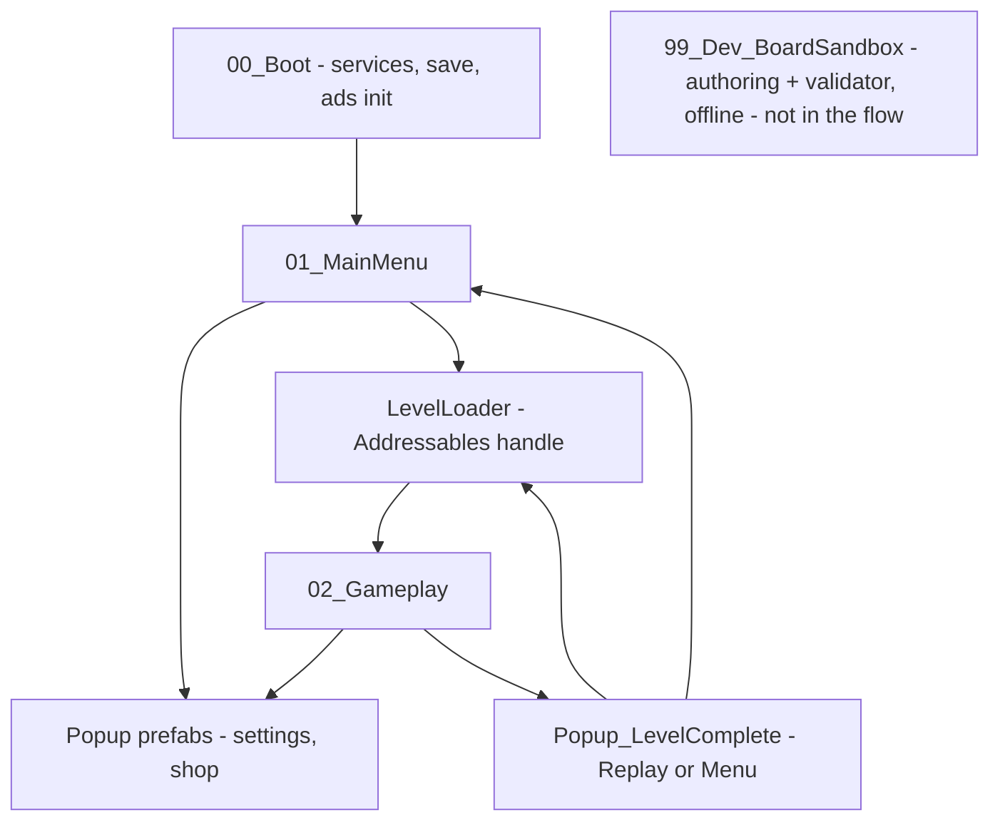
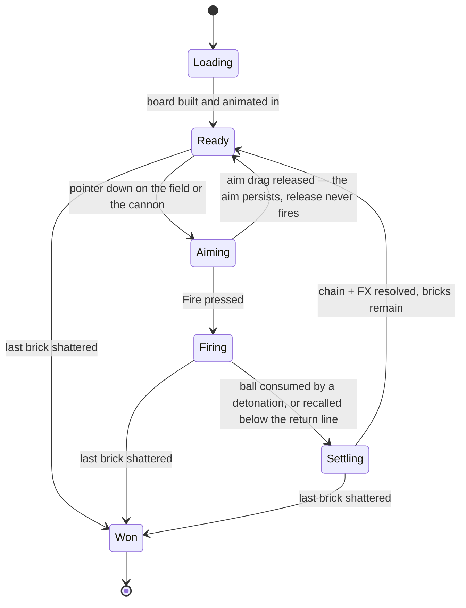

# Game Scene Structure Plan
**Game:** color-match brick breaker, "Bricks n Balls" lineage — portrait, mobile-first, endless numbered levels.
**Sources:** `technical_stack.md` (authoritative for tech), `repo_layout.md` (authoritative for file/class names and folder shape), `gameplay.md` (authoritative for rules, controls, state and level content), `prototype.jpg` (authoritative for layout).

**Priority:** tech → layout/naming → look. Where this document previously disagreed with `gameplay.md` about *rules*, `gameplay.md` wins; where it disagreed about *names*, `repo_layout.md` wins. All twelve resulting deltas are listed in **§9** and have been applied throughout this document.

---

## 0. What the references lock in

| From | Locked decision |
|---|---|
| Stack | Unity 6 LTS + URP **2D Renderer**, Physics 2D, Input System, uGUI + TMP, DOTween, Cinemachine, ScriptableObject content, Addressables, LevelPlay, Unity IAP, Analytics + Crashlytics, JSON save |
| Mockup | Portrait lock, 10-column block grid, cannon at bottom, dashed return line, 3-color objective HUD, settings gear + restart buttons, 320×50 ad banner slot at the very bottom |
| Mockup | Block vocabulary: `R`/`B`/`Y` colored, light neutral, dark crossed **steel/indestructible** |
| Mockup | Heavy bloom/juice: glowing balls with trails, shard bursts per color, cannon + reticle |

Priority rule applied: where the mockup and the stack disagree (e.g. a 3D VFX idea), the stack wins — everything is 2D sprites + particles + URP post.

---

## 1. Scene inventory & flow

Keep it to **4 scenes** (`repo_layout.md`). Everything else is a prefab. Fewer scenes = faster iteration and no addressables churn while the game is small.

| Scene | Purpose | Contents |
|---|---|---|
| `00_Boot.unity` | Cold start, ~1 frame of work | Service locator init: Addressables, Save, Analytics, LevelPlay, IAP, AudioMixer, then `LoadSceneAsync(MainMenu)` |
| `01_MainMenu.unity` | Entry hub | Title, big Play button, level number, settings, shop/remove-ads, banner anchor |
| `02_Gameplay.unity` | The level (replaces `SampleScene.unity`, which is deleted) | Full hierarchy in §2 |
| `99_Dev_BoardSandbox.unity` | Board authoring + validator target | `GridOrigin` + `BoardGizmos` + `LevelValidatorWindow` host; never in the build |

Popups (`Settings`, `LevelComplete`, `Shop`) are **prefabs**, not scenes — instantiated into a dedicated popup canvas. There is **no** `LevelFailed` and **no** `ConfirmRestart` popup: the game has no fail state, and restart is instant (`gameplay.md` §3 rule 12, §7).



---

## 2. Gameplay scene hierarchy

This is the deliverable. Empty "separator" objects keep the hierarchy readable in the Editor — cheap now, invaluable at 200 GameObjects.

```
02_Gameplay.unity
├─ ▶ [SYSTEMS]
│  ├─ GameBootstrap            # scene entry: loads LevelDefinition, kicks off build
│  ├─ GameManager              # FSM owner, s_Instance, public UnityAction OnStateChanged
│  ├─ LevelController          # instantiates/destroys the board from LevelDefinition
│  ├─ BoardState               # 2D occupancy array + remaining count per color
│  ├─ ObjectiveTracker         # win condition: bricks remaining == 0 (no fail evaluation)
│  ├─ InputReader              # wraps Input System "Gameplay" action map
│  ├─ AimController            # drag → direction, clamps angle, drives preview
│  ├─ BallStream               # single-ball lifecycle: spawn, recall/consume, reload (no budget, no cadence)
│  ├─ PoolService              # blocks, balls, FX, trajectory dots
│  ├─ VFXService               # play burst by color/type at world pos
│  ├─ AudioService             # AudioMixer groups: Master/Music/SFX/UI
│  ├─ CameraShaker             # Cinemachine ImpulseSource wrapper
│  └─ AdController             # banner reserve height, interstitial gating
│
├─ ▶ [CAMERAS]
│  ├─ MainCamera               # Camera(Orthographic) + CinemachineBrain + CameraFitter
│  └─ CM_GameplayCamera        # CinemachineCamera, no follow, ImpulseListener
│
├─ ▶ [RENDERING]
│  ├─ Global Volume            # Bloom, Tonemapping, Vignette, Color Adjustments
│  └─ Backdrop                 # bg gradient quad + grid-slot sprite + arena border
│
├─ ▶ [LEVEL]
│  ├─ Arena
│  │  ├─ GridOrigin            # Transform: row0/col0 origin — single source of grid math
│  │  ├─ Walls
│  │  │  ├─ Wall_Left          # BoxCollider2D, layer Wall
│  │  │  ├─ Wall_Right         # BoxCollider2D, layer Wall
│  │  │  └─ Wall_Top           # BoxCollider2D, layer Wall (ceiling)
│  │  ├─ ReturnLine            # dashed sprite (Foreground) + BoxCollider2D isTrigger, layer Sensor
│  │  ├─ Blocks                # runtime parent — pooled Block prefabs
│  │  └─ Obstacles             # runtime parent — steel blocks (separate for cheap iteration)
│  ├─ Cannon
│  │  └─ CannonRoot            # DOTween recoil target
│  │     ├─ Cannon_Base        # static sprite
│  │     ├─ Cannon_Head        # rotates toward aim
│  │     ├─ MuzzlePoint        # ball spawn transform (child of Head)
│  │     └─ FX_MuzzleFlash     # ParticleSystem + additive sprite
│  ├─ AimRig
│  │  ├─ SightLine             # straight muzzle→✕ line, no reflections (nothing is ever drawn ahead of the ball)
│  │  ├─ AimReticle            # the ✕ reticle from the mockup
│  │  └─ OnboardingHint        # was AimCancelHint; no cancel gesture exists now that Fire is a button
│  └─ Balls                   # runtime parent — pooled Ball prefabs
│
├─ ▶ [VFX_POOL]                # pooled FX instances + TrailRun trail segments (never destroyed mid-level)
│
├─ ▶ [UI]
│  ├─ Canvas_HUD               # Screen Space Overlay, sort order 100
│  │  ├─ SafeAreaRoot          # SafeAreaRect — notch / punch-hole padding
│  │  │  ├─ TopBar             # anchored top, horizontal
│  │  │  │  ├─ Btn_Settings
│  │  │  │  ├─ Txt_LevelTitle  # TMP "LEVEL 1"
│  │  │  │  ├─ Btn_Restart     # instant, no dialog, icon spins on tap
│  │  │  │  └─ Legend          # HorizontalLayoutGroup — STATIC legend of the board's ball kinds
│  │  │  │     ├─ LegendItem_Red    # never depletes, never reorders, never counts down
│  │  │  │     ├─ LegendItem_Blue
│  │  │  │     └─ LegendItem_Yellow
│  │  │  └─ BottomBar          # anchored bottom, sits above the banner reserve
│  │  │     ├─ BallPicker      # tray of the board's ball kinds; tap to load into the cannon
│  │  │     ├─ Btn_Fire        # the only way to fire — releasing an aim drag never fires
│  │  │     └─ AdBannerAnchor  # RectTransform 320×50 dp, empty placeholder
│  │  └─ ScreenFeedback        # full-screen Image: flash, vignette pulse
│  └─ Canvas_Popups            # Overlay, sort order 200
│     └─ PopupHost             # single instance host for popup prefabs
│
└─ ▶ [DEBUG]                   # dev-only, stripped from release
   ├─ DebugHud                 # FPS, active balls, pooled counts
   └─ Cheats                   # skip level, force win/fail, add balls
```

**Why this shape:** every runtime-spawned object lives under exactly one parent (`Blocks`, `Balls`, `VFX_POOL`), so a level reset is `ClearChildren()` + pool release, with no scene reload. `GridOrigin` is the *only* place grid→world math is anchored, so board authoring, spawning and ball placement all read from one transform.

---

## 3. World layout & camera contract

Derived from the mockup (663×1152 → grid spans ~96% of width, 13 visible rows, return line at ~76% of screen height).

**Fixed, device-independent world coordinates (1 cell = 1 unit; gameplay sprites are drawn at **256 px/cell and imported at PPU 256**, so one sprite = exactly one unit — 100 stays the project default for non-grid art):**

| Element | World value |
|---|---|
| Grid | x ∈ [−5, +5], y ∈ [0, 13] — 10 cols × 13 rows, cell = 1.0 |
| GridOrigin | (−5, 0) — bottom-left cell corner |
| Walls | contoured to grid + one cell of clearance |
| ReturnLine | y = −0.30 |
| Cannon pivot | y ≈ −3.0, muzzle ≈ −2.0 |
| Arena width required | 10.8 units (10 grid + 0.4 side margin) |

**Camera rule — width is sacred, grid is top-anchored:**

```
orthoSize  = max( (10.8 / 2) / camera.aspect , 8.85 )
camera.y   = GRID_TOP + topMargin - orthoSize        // GRID_TOP = 13, topMargin = 0.6
screenBottom = camera.y - orthoSize
cannon.y   = screenBottom + bannerUnits + cannonBottomPad   // banner-aware
```

- The 10 columns **always** fit horizontally — never a cropped column on any phone.
- Taller devices get extra space at the *bottom only*; the board never moves.
- `AdController` publishes `bannerUnits` (a real 320×50 dp banner is ~1.5 world units tall on a 1080-wide screen — it genuinely displaces the cannon, which is why the mockup reserves it).
- Aim is computed muzzle→pointer in world space, so a moving cannon Y never changes shot angles.

> **PENDING (open decision):** on very tall devices (20:9) this formula strands the cannon far below the return line, weakening the mockup's "cannon directly under the line" read. Recommendation: cap the drop with `cannon.y = max(screenBottom + bannerUnits + cannonBottomPad, ReturnLineY − 2.5)` and let the banner own the true screen bottom. Not applied yet — confirm before implementing `CameraFitter`.

---

## 4. Layers, sorting & physics contract

**Unity layers:** `Ball(8)`, `Block(9)`, `Wall(10)`, `Sensor(11)`, `FX(12)`, `UIWorld(13)`

| Pair | Enabled | Behaviour |
|---|---|---|
| Ball ↔ Block | yes | reflect + damage |
| Ball ↔ Wall | yes | reflect |
| Ball ↔ Ball | **no** | balls must not clump — critical |
| Ball ↔ Sensor | yes (trigger) | recall ball, return to budget |
| Block ↔ Block, Block ↔ Wall | no | static board |

**Sorting layers (2D Renderer):** `Background` → `GridSlots` → `ReturnLine` → `Blocks` → `BallTrail` → `Balls` → `FX` → `AimGuide` → `Foreground`

**Physics settings:** `Physics2D.gravity` ignored per-ball (`gravityScale = 0`); balls use `Dynamic` Rigidbody2D with `Interpolation = Interpolate`, `Collision Detection = Continuous`; `fixedDeltaTime = 1/60`; no physics materials — velocity is **reflected and re-normalized** on collision so ball speed is exactly constant forever (no drift, deterministic trajectory preview).

---

## 5. Prefabs & Addressables inventory

| Prefab | Key components | Pooled |
|---|---|---|
| `Block_Base` | SpriteRenderer, BoxCollider2D, `Block` | yes |
| `Ball_Base` | Rigidbody2D, CircleCollider2D, `Ball`, `BallTrail` (drives pooled `TrailRun` segments — no `TrailRenderer`) | yes |
| `FX_Break_Red/Blue/Yellow/Neutral` | ParticleSystem bursts + additive flash | yes |
| `FX_MuzzleFlash`, `FX_ImpactSpark` | ParticleSystem | yes |
| `TrailRun` | LineRenderer + additive material — one straight run of the comet trail | yes |
| `Cannon_Base`, `Cannon_Head` | SpriteRenderer | no |
| `Popup_Settings`, `Popup_LevelComplete`, `Popup_Shop` | Canvas group, BlockRaycastController, DOTween show/hide | no |

**Addressables groups:** `Levels_Pack_XX` (level SOs), `Art_Blocks`, `Art_UI`, `Art_FX`, `Audio_SFX`, `Audio_Music`. Local by default; remote only for post-launch level packs.

---

## 6. Data & state

| ScriptableObject | Key fields | Consumer |
|---|---|---|
| `GameplayConfig` | ballRadius, ballSpeed, fastForwardMultiplier, aimClampAngleDeg, maxTrailRuns, trailRunFadeSec, trailDissipateSec, chainStaggerSec, detonationFreezeSec, cannonRailHalfWidth, shotTimeoutSec, shakeScale | BallStream, AimController, BallTrail, CameraShaker |
| `LevelDefinition` | levelId, displayName, `rows[]`, parShots — `colorsUsed` / `brickCount` are **derived by the validator** | LevelController, ObjectiveTracker |
| `BlockDefinition` | kind (Brick / Colored / Steel), color, hp, sprites, breakFx, breakSfx, isIndestructible | Block |
| `BallSkin` | sprite, glow, trail gradient | Ball, BallTrail |
| `VFXDefinition` | particle prefab, flash color, shard count, impulse, sfx | VFXService |
| `LevelPack` | levelIds[], unlockRule — M5 remote packs | Addressables loader |

**Level map encoding** (one string per row, top row first; schematic, not a transcription):

```
"S.N.R.B.Y.."   // '.' empty   'N' brick — the objective, 1 hit, never explodes
"N.S.N.S.N.S."  // 'S' steel — indestructible ✕, blocks balls and chains
"..R...B..Y."   // 'R'/'B'/'Y' coloured detonators
"N.S..N..S.N."  // 'M' armour and 'X' mystery are RESERVED — not implemented (gameplay.md §1)
```

`LevelDefinition` is the single authoring surface — a designer can build a level as text with zero prefab work.

### Gameplay state machine



There is no `Lost` state — `gameplay.md` §3 rule 12: the level can only ever end in a win.

---

## 7. HUD / UX spec (per mockup region)

| Region | Element | Behaviour |
|---|---|---|
| Top-left | `Btn_Settings` | opens Popup_Settings; pauses FSM |
| Top-centre | `Txt_LevelTitle` | "LEVEL 1" — TMP, no resizing per level |
| Top-right | `Btn_Restart` | instant, free, unlimited — no confirmation dialog; icon spins on tap |
| Below title | 3 kind icons + dashes | **static legend** of the board's ball kinds — not interactive, nothing counts down |
| Field | `AimReticle` | follows pointer; scales up on hold |
| Field | `SightLine` | straight muzzle→✕ line only — no reflections, no path preview |
| Bottom | `ReturnLine` | dashed red trigger; a ball fully below it ends the shot and the cannon reloads with the same kind |
| Bottom | `Cannon` + side arrows | left/right arrow sprites hint the drag axis, as in the mockup |
| Bottom | `BallPicker` + `Btn_Fire` | tray of the board's ball kinds; tap to load, Fire launches the loaded ball |
| Bottom-most | `AdBannerAnchor` | empty RectTransform, 320×50 dp; camera/cannon adapt to its height |

CanvasScaler: Scale With Screen Size, reference 1080×1920, **Match = 1 (width)** so HUD density is stable across the 10-column layout; `SafeAreaRoot` handles notches.

---

## 8. VFX & audio plan

**Break burst (per color, pooled):** 8–14 small cube sprites with random spin, gravity 0.6, drag, lifetime 0.4–0.7 s, size+alpha fade → additive radial flash scale 0.3→1.4 over 0.25 s → Cinemachine impulse 0.1–0.25 → DOTween board-slot punch. Bloom does the glow for free; do **not** add `Light2D` per impact (mobile fill-rate).

**Ball:** additive core sprite + soft glow sprite; small spark on impact; pop on despawn.

**Comet trail (exact spec in `gameplay.md` §4):** a `TrailRenderer` cannot express "at most the last 5 straight runs, oldest run fading out on the 6th bounce", so `BallTrail` keeps a ≤5-entry queue of pooled `TrailRun` segments — one `LineRenderer` per straight run, each with a gradient brightest where it meets the ball, weighted by age, so the composite reads as one comet fading toward its far end. The oldest run fades over 0.25 s on overflow; all runs dissipate within ~1 s of the shot ending. Sorting layer `BallTrail` — above blocks, below the ball.

**Cannon:** DOTween recoil punch on `CannonRoot`, muzzle flash sprite + smoke particle.

**Screen feedback:** `ScreenFeedback` image flash on ball recall, vignette pulse on win/lose; staggered block collapse for level complete.

**AudioMixer groups:** `Master` → `Music`, `SFX`, `UI`. One-shots via a small voice pool; ducking on win/lose stingers.

---

## 9. Conflict resolutions applied

This document was written before `gameplay.md`, and the two disagreed in twelve places. All twelve are resolved below and the rest of this document has been corrected to match. `gameplay.md` is authoritative for rules; `repo_layout.md` is authoritative for names.

| # | Topic | Was | Now (applied) | Authority |
|---|---|---|---|---|
| C1 | Aim preview | `TrajectoryPreview` — 6–10 analytic-reflection dots | `SightLine` — straight muzzle→✕ only, nothing ever drawn ahead of the ball. The reflection solver is kept behind an interface so a preview can be added later without touching `AimController` | `gameplay.md` §4 ("Preview: none") and §9#3; `repo_layout.md` already names `SightLine` |
| C2 | Ball supply | `BallStream` spawn cadence, `maxActiveBalls`, ball budget | Class **name kept**; redefined as the single-ball lifecycle (spawn → recall/consume → reload). No budget, no cadence | `gameplay.md` §3 rules 1, 3, 5 |
| C3 | Fail state | `Settling → Lost`, `UILose`, `Popup_LevelFailed` | All removed. FSM is `Loading → Ready → Aiming → Firing → Settling → {Ready \| Won}` | `gameplay.md` §3 rule 12, §7 |
| C4 | Header pips | 3 objective pips, progress fill, completion pulse | `Legend` — static, non-interactive, nothing counts down | `gameplay.md` §5, §8 |
| C5 | Fire trigger | FSM: pointer-up fires, dead-zone release cancels | `Btn_Fire` fires. Releasing an aim drag persists the aim and never fires; the cancel hint is retired with the gesture | `gameplay.md` §4 controls |
| C6 | Restart | `Popup_ConfirmRestart` dialog | Instant + spin-on-tap, no dialog | `gameplay.md` §7, §9#5 |
| C7 | Ball selection | absent from the hierarchy (implicit cycle) | `BallPicker` tray + `Btn_Fire` added to `BottomBar`, above `AdBannerAnchor` | `gameplay.md` §5/§8; `repo_layout.md` names `BallPicker` and the picker tray |
| C8 | Level data | `ballBudget`, `starThresholds`, `allowedColors`, `score` | `LevelDefinition` = `levelId`, `displayName`, `rows[]`, `parShots`; `colorsUsed` / `brickCount` are validator-derived | `gameplay.md` §3 rule 5, §9#4 |
| C9 | `AimDot` | pooled aim dot sprites | Dropped — no preview exists. `Prefabs/Aim/` = `AimReticle` + `SightLine` | `gameplay.md` §4 |
| C10 | Scene count | 3 | **4**, adding `99_Dev_BoardSandbox.unity` | `repo_layout.md` §2 |
| C11 | SO location | rule 4 said `Resources/SO/{Levels,Voxel}` | All authored content lives in `GameData/`; `Resources/` is package-mandated only | `repo_layout.md` §2 + rule 6 |
| C12 | Map encoding | `M` armour, `X` mystery | `Brick` / `Colored` / `Steel` only; `M` and `X` marked **reserved** (keeping `BlockDefinition.hp` makes `M` a data-only addition later) | `gameplay.md` §1 |
| D1 | Comet trail | `TrailRenderer` with a gradient fade | Pooled `TrailRun` `LineRenderer` segments, ≤5 runs — a `TrailRenderer` cannot drop the oldest *run* on the 6th bounce | derived from `gameplay.md` §4 |

Two further items are not conflicts but unresolved **level-arithmetic** questions — see `gameplay.md` §6 → *Open items*.

---

## 10. Project-setting deltas required (verified against the current project)

| Setting | Now | Needed |
|---|---|---|
| `defaultScreenOrientation` | `4` (AutoRotation) | `0` (Portrait) |
| `defaultScreenWidth/Height` | 1920 × 1080 | 1080 × 1920 |
| `allowedAutorotate*` | all `1` | portrait only |
| Colour space | Linear ✔ | keep |
| `activeInputHandler` | `2` (Both) ✔ | keep or narrow to Input System |
| URP 2D Renderer | present ✔ | keep |
| Layers & sorting layers of §4 | template defaults only — none of them exist (verified in `TagManager.asset`) | create `Ball/Block/Wall/Sensor/FX/UIWorld` + the 9 sorting layers in the setup step |
| `Fixed Timestep` | `0.02` (1/50) | `0.0166667` (1/60) per §4 |
| TMP essentials | not imported (`Assets/TextMesh Pro/` is absent) | import programmatically in the setup step, never by hand |
| Missing packages | — | Cinemachine, Addressables, LevelPlay, Unity IAP, Analytics, Crashlytics. **DOTween is not on the Unity registry** — OpenUPM scoped registry or a vendored Asset Store import; the free tier is enough (**route still open**) |
| iOS build module | not installed (Android + UWP only on `6000.0.68f1`) | `unity install-modules` when an iOS build is needed |

Also: `SampleScene.unity` is deleted and replaced by `02_Gameplay.unity`, and `99_Dev_BoardSandbox.unity` is added — 4 scenes total (`repo_layout.md`). `Assets/UniversalRenderPipelineGlobalSettings.asset` and `Assets/DefaultVolumeProfile.asset` move into `Settings/`.
