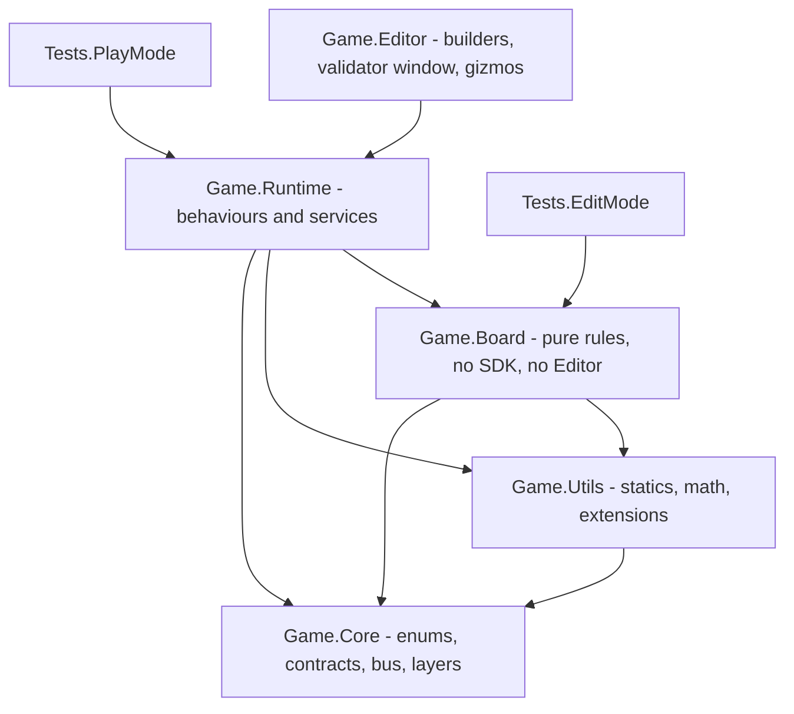
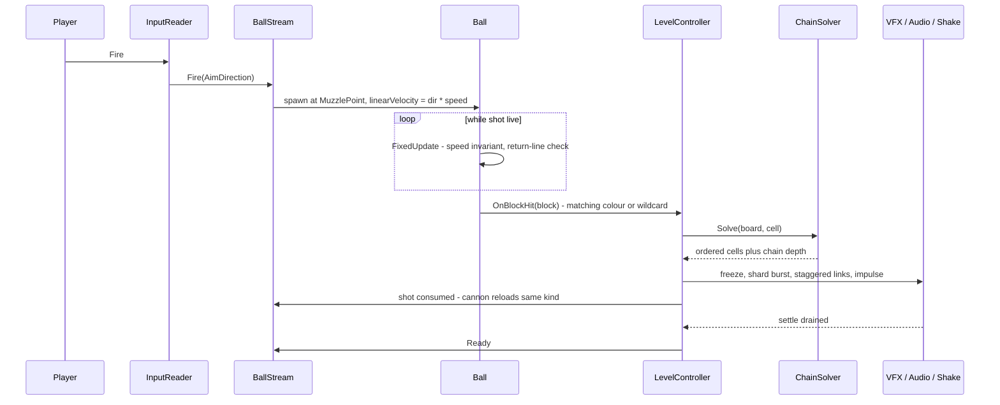

## Technical Design — *Block Breaker* (Unity 6, portrait, mobile-first)

**Verified baseline**:

| Fact | Value | Implication |
|---|---|---|
| Editor | `6000.0.68f1` | Unity 6 LTS; URP 17 APIs; `linearVelocity` naming applies |
| Packages present | URP `17.0.4`, Input System `1.18.0`, uGUI `2.0.0`, Test Framework `1.6.0`, 2D feature set | core loop is buildable today |
| Packages missing | Cinemachine, Addressables, LevelPlay, IAP, Analytics, Crashlytics, **DOTween** | setup step; DOTween route still open |
| Gameplay code | **none** — `Assets/Scripts/` does not exist | every class below is greenfield |
| Scenes | only `SampleScene.unity` + URP template | §10 scene deltas still outstanding |
| Layers / sorting layers | `Default`, `TransparentFX` only (TagManager) | §4 of `scene_structure.md` is unbuilt |
| Orientation / resolution | `4` (AutoRotation), 1920×1080, all autorotate flags `1` | portrait lock outstanding |
| Colour space | `m_ActiveColorSpace: 1` (Linear) | correct already, keep |
| Input handler | `activeInputHandler: 2` (Both) | works; narrowing is optional hygiene |
| Physics 2D | gravity (0,−9.81), velocity iterations 8, position iterations 3, `m_VelocityThreshold: 1` | gravity neutralised per-ball (`gravityScale = 0`), not globally |
| TMP | `Assets/TextMesh Pro/` absent | must be imported before any TMP text renders |

---

## 1. Architecture at a glance

### 1.1 Assembly definitions **[ADD]**

`repo_layout.md` fixes folders by role but says nothing about assemblies. Without asmdefs the whole project is one `Assembly-CSharp`, which means (a) EditMode tests drag in IAP/Ads/Addressables, and (b) `Board/`'s documented "pure, no Editor deps" property is enforced by nothing. Two asmdefs plus test asmdefs make both machine-checked:

| Assembly | Folder | References | Platform |
|---|---|---|---|
| `Game.Core` | `Scripts/Core` | engine only | all |
| `Game.Utils` | `Scripts/Utils` | `Game.Core` | all |
| `Game.Board` | `Scripts/Runtime/Board` | `Game.Core`, `Game.Utils` | all |
| `Game.Runtime` | `Scripts/Runtime/**` (minus `Board`) | above + InputSystem, CM, Addressables, TMPro, DOTween, UGS, LevelPlay, Purchasing | all |
| `Game.Editor` | `Scripts/Editor` | all + `UnityEditor` | Editor only |
| `Game.Tests.EditMode` | `Tests/EditMode` | `Game.Board`, `Game.Core`, `Game.Utils`, test framework (`overrideReferences` + `TestAssemblies`) | Editor only |
| `Game.Tests.PlayMode` | `Tests/PlayMode` | `Game.Runtime` + test framework | all |

`Game.Board` referencing **nothing third-party** is what makes `GridMath`, `BoardState`, `ChainSolver` and `LevelValidator` testable in milliseconds and reusable by `Editor` tools. This is the single highest-leverage structural decision in the document.

### 1.2 Dependency rule



Hard rules: `Board` never references `Runtime`; `Runtime` never references `UnityEditor`; **no gameplay system references an SDK type directly** — ads, IAP, analytics and remote config sit behind interfaces declared in `Game.Core` (§3.3). That is what lets the editor play the game with fake ad/IAP services and lets PlayMode tests run without network.

### 1.3 Services: interface + SDK adapter **[ADD]**

| Interface (`Core/Services`) | Adapter (`Runtime/Services`) | Fake for editor/tests |
|---|---|---|
| `IAnalyticsService` | `UnityAnalyticsService` / `FirebaseAnalyticsService` | `NullAnalyticsService` |
| `IAdService` | `LevelPlayAdService` | `NoAdsService` |
| `IIAPService` | `UnityIAPService` | `NoIAPService` |
| `ISaveService` | `JsonSaveService` (`persistentDataPath`) | in-memory |

`ServiceLocator` resolves these at boot; `GameBootstrap` registers fakes when `AdConfig`/`AnalyticsConfig` are absent or when `Application.isEditor` is set to offline mode. No gameplay file ever writes `using Unity.Services.…`.

---

## 2. Runtime object model

Every row of the `scene_structure.md` §2 hierarchy maps to exactly one owner. `●` = MonoBehaviour in the scene, `□` = prefab-bound, `△` = pure C# (`Game.Board`).

| Object | Type | Responsibility | Public surface (abridged) |
|---|---|---|---|
| `GameBootstrap` | ● | one-frame entry: register services, read `GameplayConfig`, kick `LevelController`, arm FSM | `void Run()` |
| `GameManager` | ● | FSM owner, `s_Instance`, input gating, pause gate | `static GameManager Instance`, `GameState State`, `UnityAction<GameState> OnStateChanged`, `void ChangeState(GameState)`, `void SetPaused(bool)` |
| `LevelController` | ● | build/reset board from `LevelDefinition`, own `Blocks`/`Obstacles` parents | `void Build(LevelDefinition)`, `void ResetBoard()`, `UnityAction<ChainResult> OnDetonation`, `UnityAction OnBoardCleared` |
| `BoardState` | △ | occupancy grid, per-cell block id, remaining counts | `BlockKind KindAt(Vector2Int)`, `GameColor ColorAt(Vector2Int)`, `int BricksRemaining`, `IEnumerable<Vector2Int> Cells` |
| `GridMath` | △ | the only cell↔world authority | `Vector3 CellToWorld(Vector2Int)`, `Vector2Int WorldToCell(Vector3)`, `bool InGrid(Vector2Int)`, `IEnumerable<Vector2Int> Ring8(Vector2Int)` |
| `ChainSolver` | △ | detonation + same-colour chain, deterministically ordered | `ChainResult Solve(BoardState, Vector2Int seed)` |
| `LevelValidator` | △ | coverage + access checks | `ValidationReport Validate(LevelDefinition)` |
| `ObjectiveTracker` | ● | win condition only | `int BricksRemaining`, `UnityAction OnWin` |
| `InputReader` | ● | wraps the `Gameplay` action map; single enable switch | `UnityAction<Vector2> OnPress`, `OnDrag`, `OnRelease`, `UnityAction OnFire`, `OnRestart`, `OnFastForward`, `bool Aiming` |
| `AimController` | ● | pointer→direction, angle clamp, drives reticle + sight line | `Vector2 AimDirection`, `UnityAction<Vector2> OnAimChanged` |
| `CannonController` | ● | rail position, head rotation, recoil, loaded-kind visual | `void SetRailX(float)`, `float RailX`, `void PlayRecoil()` |
| `SightLine` | ● | 2-point `LineRenderer`, muzzle → reticle, **no reflections** | `void Set(Vector2 from, Vector2 to)` |
| `BallStream` | ● | single-ball lifecycle: spawn → resolve → reload | `void Fire(Vector2 dir)`, `void Recall()`, `GameColor LoadedKind`, `UnityAction<GameColor> OnLoadedKindChanged` |
| `Ball` | □ | constant-speed motion, reflection, contact reporting | `UnityAction<Block> OnBlockHit`, `UnityAction OnReturned`, `float Speed` |
| `BallTrail` | □ | ≤5 pooled `TrailRun` segments, age-weighted fade | `void Begin()`, `void AddRun(Vector2 from, Vector2 to)`, `void EndShot()` |
| `Block` | □ | one cell: kind, colour, sprite, destroy FX hook | `Vector2Int Cell`, `BlockKind Kind`, `GameColor Color`, `void Shatter(bool chained)` |
| `BallPicker` | ● | tray of `colorsUsed`; loads the cannon | `void Build(IReadOnlyList<GameColor>)`, `GameColor Selected` |
| `PoolService` | ● | keyed pools, warm-up, no runtime `Instantiate` | `T Spawn<T>(T prefab, Vector3, Quaternion)`, `void Despawn(Component)`, `void ReleaseAll(PoolId)`, `void Prewarm(PoolId, int)` |
| `VFXService` | ● | burst by colour/type at world pos; holds `SettleToken`s | `void PlayBreak(Vector2, GameColor)`, `void PlayImpact(Vector2, float)` |
| `AudioService` | ● | mixer groups, voice pool, pitch ladder, ducking | `void Play(SfxId, float pitch = 1)`, `void DuckMusic(float, float)` |
| `CameraShaker` | ● | Cinemachine impulse wrapper, scaled + pause-safe | `void Shake(float amplitude)` |
| `CameraFitter` | ● | applies §3 camera contract and banner reserve | `void Refit()`, `float OrthoSize` |
| `AdController` | ● | banner reserve, interstitial gating; implements `IAdService` | `float BannerUnits`, `UnityAction<float> OnBannerReserveChanged` |
| `SaveService` | ● | JSON at `persistentDataPath` | `PlayerData Load()`, `void Save(PlayerData)` |
| `UIManager` | ● | popup host, one popup at a time | `void Show(PopupId)`, `void Hide()`, `UnityAction OnPopupClosed` |

**Lifetime rules.** Runtime-spawned objects live under exactly one of `Blocks`, `Obstacles`, `Balls`, `[VFX_POOL]`. Nothing is `Destroy`ed during play — destruction is `PoolService.Despawn`. Restart is `ReleaseAll` + `Build` from the already-loaded `LevelDefinition`, with no scene reload and no Addressables churn (`scene_structure.md` §2 rationale, honoured).

---

## 3. Data model & authoring pipeline

### 3.1 ScriptableObjects

Fields as specified in `scene_structure.md` §6 — with three additions needed to make them actually work **[ADD]**:

| SO | Additions | Why |
|---|---|---|
| `LevelDefinition` | `BlockPalette palette`; `[NonSerialized] BoardState InitialState` | the level needs a char→`BlockDefinition` lookup; restart needs the pristine state without re-parsing |
| `GameplayConfig` | `PoolWarmup[] warmups`, `aimClampFromUpDeg` (rename of `aimClampAngleDeg` for clarity) | pool sizing is config, not code; the clamp is measured *from up* |
| `BlockPalette` (new, `GameData/Configs/`) | `char` → `BlockDefinition` map, including reserved `M`/`X` | keeps reserved-char rejection data-driven and out of the parser |

`BlockDefinition.hp` stays (1 for all current kinds) so armoured `M` is later a data-only addition, exactly as `scene_structure.md` §9 C12 intends.

### 3.2 Encoding & the row-order trap

`rows[]` is **top row first**; the grid is **y-up with row 0 at the bottom** (`scene_structure.md` §3). The conversion must exist in exactly one place and be unit-tested:

```
row  = rows.Length - 1 - index      // index 0 = top row
cell = (col, row)
world = GridOrigin.position + new Vector3(col + 0.5f, row + 0.5f, 0f)
```

Getting this wrong silently mirrors every level vertically and would still "look plausible". Therefore: `GridMathTests` asserts a known asymmetric fixture round-trips, and `LevelController` never computes world positions itself.

**Parser contract:** exactly 10 chars per row (current grid), in-grid only; `.` `N` `S` `R` `B` `Y` accepted; `M`/`X` rejected with `"reserved kind, not implemented"`; anything else rejected with index + char. Errors are collected, not thrown one at a time — the validator window reports all at once.

### 3.3 Derived, never authored

`colorsUsed` and `brickCount` are validator outputs (`gameplay.md` §9 C8). They are computed at validation time, cached in the SO by the Editor tool, and marked `[NonSerialized]`/read-only at runtime so a designer cannot hand-write a lie the HUD then displays.

### 3.4 Authoring pipeline

`repo_layout.md` rule: **every Unity object under `Assets/` is created by an idempotent editor method, never hand-edited YAML.** Concretely, `Game.Editor` exposes a one-shot chain, each method safe to re-run:

`ProjectSetup.Run()` → `SpriteForge.Run()` → `PrefabBuilder.Run()` → `LevelAssetBuilder.Run()` → `SceneBuilder.Run()` → `BuildScript.Run()`

Run headless through the Unity CLI (per `AGENTS.md`: CLI first, not manual YAML):

```
unity run --project D:\unity\practice2 -batchmode -quit -executeMethod Game.Editor.Builders.ProjectSetup.Run
```

`ProjectSetup` owns exactly the §10 deltas: portrait lock, 1080×1920 reference, autorotate flags, `fixedDeltaTime = 0.0166667`, the six layers (`Ball 8`, `Block 9`, `Wall 10`, `Sensor 11`, `FX 12`, `UIWorld 13`), nine sorting layers, URP 2D renderer asset, volume profile, package installs and TMP essentials. It must be **idempotent** — it is the project's bootstrap, and re-running it after a template reset has to be safe.

---

## 4. Core algorithms

### 4.1 Detonation & chain solver (the heart of the game)

`ChainSolver` is pure, deterministic and fully testable — it never touches physics, tweens or FX. It consumes a `BoardState` snapshot plus the seed cell that the ball's matching-colour hit produced, and returns an ordered plan that the presentation layer merely *plays back*.

```
ChainResult Solve(BoardState grid, Vector2Int seed, GameColor ballColor)

  if grid.KindAt(seed) != Colored or not Matches(ballColor, grid.ColorAt(seed)) -> empty result
  queue <- [seed];  visited <- {seed};  destroyed <- [];  depthOf <- {}
  depth <- 0
  while queue not empty:
      next <- []
      foreach c in queue:
          destroyed.Add(c); depthOf[c] <- depth                       // the coloured block dies
          foreach n in Ring8(c):                                       // 8-way, clipped to grid
              if grid.KindAt(n) == Brick:
                  if n not in destroyed: destroyed.Add(n); depthOf[n] <- depth
              else if grid.KindAt(n) == Colored
                   and grid.ColorAt(n) == grid.ColorAt(c)
                   and n not in visited:
                  visited.Add(n); next.Add(n)                           // same colour only
      queue <- next; depth <- depth + 1
  return ChainResult(destroyed, depthOf)

Matches(ballColor, blockColor) = (ballColor == Wildcard) or (ballColor == blockColor)
```

Locked semantics, straight from `gameplay.md` §3 rules 6–10 and mirrored here so no implementation can drift:

- **Ring is 8-way and clipped at the grid edge** — a centre on row 12 or a column at the border simply has fewer neighbours. Out-of-grid cells are *not* errors.
- **Bricks never chain.** They are destroyed, never enqueued.
- **A different-coloured block inside a ring survives** and remains an obstacle (rule 7). Only the matching colour is consumed. `C` cells are therefore *not* all cleared by one shot — that is the puzzle.
- **Steel is inert** in every direction (rule 10).
- **Each cell is destroyed at most once**, tracked by the `destroyed` set, regardless of how many rings cover it. Zone overlap is expected (the lattice in `gameplay.md` §6 has adjacent rings), so this is load-bearing, not defensive.
- **`depth` is the chain-link index** and drives the 50 ms stagger and the ascending audio pitch — the combo counter is therefore audible *and* deterministic, never a race between physics callbacks.

`ChainResult` also carries `BricksDestroyedByColour`, which `ObjectiveTracker` subtracts from `BricksRemaining` in one pass, so the win check is one integer comparison rather than a per-cell rescan.

### 4.2 Ball motion — the constant-speed invariant

Two rules from §4/§3 of `scene_structure.md` drive every line here: gravity 0, no physics materials, and speed that is **exactly constant forever**.

| Concern | Design |
|---|---|
| Body | `Dynamic`, `gravityScale = 0`, `constraints = FreezeRotation`, `Interpolation = Interpolate`, `collisionDetectionMode = Continuous` |
| Seeding | `rb.linearVelocity = dir.normalized * targetSpeed` (**Unity 6 renamed `velocity` → `linearVelocity`, `drag` → `linearDamping`** — the old names still compile with warnings; use the new ones) |
| Reflection | On `OnCollisionEnter2D`: take `collision.relativeVelocity` (equal to the ball's velocity, since every other body is static) and reflect across the contact normal, then re-normalise to `targetSpeed`. Do **not** rely on solver bounce: with no physics material the engine kills the normal component, and a naive re-normalisation would then let the ball skim along a wall instead of bouncing off it |
| Multi-contact frames | Average the contact normals before reflecting, so a corner hit produces one correct reflection instead of two sequential ones |
| Normal sign | `Vector2.Reflect` is sign-invariant, so contact ordering cannot invert the bounce — no defensive `if` needed |
| Drift guard | In `FixedUpdate`, if `Abs(rb.linearVelocity.magnitude - targetSpeed) > 1e-3`, renormalise. Cheap, and it makes the invariant true rather than assumed |
| Tunnelling | At 1 cell = 1 unit and 1/60 s, the ball moves 0.233 u/step at 14 u/s (0.467 at 2× fast-forward). Continuous detection covers the rest; **max safe speed is 60 u/s** and `GameplayConfig` should assert it |
| Fast-forward | Raises `targetSpeed`, not a separate system. Same invariant, different constant |

**Return detection — a real defect in the current plan.** `scene_structure.md` §4 makes the `Sensor` trigger the authority for ending a shot, but Unity 2D **does not apply continuous collision detection to triggers**: a trigger is resolved as an overlap at the end of the step, so a fast ball can pass a thin dashed line entirely between two physics steps. The `Ball ↔ Sensor` row is therefore not reliable on its own. Design:

1. **Primary (authoritative, deterministic, tunnel-proof):** a geometric test in `Ball.FixedUpdate` — `transform.position.y < ReturnLineY - returnMargin` → `OnReturned`. EditMode-testable, allocation-free, no physics dependency.
2. **Secondary:** keep the `ReturnLine` trigger collider (thickened to ~1.0 unit tall) purely as an FX/timing cue; it never decides state.

This keeps `Sensor` on the layer list and the visual dashed line intact while making the shot lifecycle provably correct.

### 4.3 Level validator

`LevelValidator` implements `gameplay.md` §6's two floor rules as hard gates. It is the reason a level can never ship unwinnable.

| Check | Algorithm |
|---|---|
| Parse | rows → grid; report every malformed row/char with coordinates |
| **Coverage** | every `Brick` must have at least one `Colored` block within its 8-ring (rule: bricks are only destroyed by rings) |
| **Access** | BFS over **4-way** empty cells seeded from the landing lane (rows 0–1); a coloured block is reachable if any 4-way neighbour is a reached empty cell |
| **Chain access fallback** | fixpoint: if a coloured block is reachable and has an 8-way **same-colour** neighbour, that neighbour becomes reachable too; repeat until stable |
| Report | per-colour counts, brick count, empty count, uncovered bricks, unreachable blocks — this output *is* the "final mix" report `gameplay.md` §6 asks for |
| Clip | rings at the grid border are clipped, never reported as missing cells (zone centres sit on row 12) |

**Ball clearances — a coupling nobody wrote down.** The access rule assumes the ball physically traverses the 1-cell-wide cracks and the col-3 spine. A 1-unit cell with a full-cell block collider leaves a 1-unit gap, so with `ballRadius = 0.28` (⌀ 0.56) there is 0.44 u of clearance. If `ballRadius` ever crosses ~0.45, **every level silently becomes unsolvable in a way no rule checks**. Therefore:
- `GameplayConfig.ballRadius ≤ 0.35` is a documented hard invariant,
- `LevelValidator` (or an EditMode test) asserts `2 * ballRadius < 1f - 0.1f`, so the failure surfaces at validation time, not in playtest.

### 4.4 Camera contract

Implementation of `scene_structure.md` §3, with the arithmetic spelled out because it is easy to get subtly wrong:

```
aspect     = (float)Screen.width / Screen.height          // portrait, < 1
orthoSize  = Mathf.Max( (10.8f * 0.5f) / aspect, 8.85f )  // width is sacred
cam.y      = 13f + 0.6f - orthoSize                       // GRID_TOP + topMargin - orthoSize
screenBot  = cam.y - orthoSize
cannonY    = screenBot + bannerUnits + cannonBottomPad
```

- 10 columns always visible, grid top-anchored, taller devices gain space **only** below the board.
- `Refit()` runs on aspect change, on `OnBannerReserveChanged`, and after an ads-removal purchase (reserve drops to 0 → the cannon moves down; the camera must not be re-fitted in a way that moves the board).
- **Blocked on you:** the pending `cannon.y = max(…, ReturnLineY − 2.5)` cap. Worked example, 1080×1920: `aspect = 0.5625`, `orthoSize = 9.6`, `cam.y = 4.0`, `screenBot = −5.6`, so with `bannerUnits ≈ 1.5` the raw cannon lands near `−3.5` — **below** the proposed cap of `−2.8`, meaning the cap engages on a plain 1080×1920 phone, not just on 20:9 outliers. That is a bigger behavioural change than §3 implies, and it should be decided before `CameraFitter` is written.

### 4.5 Trails and pooling

`BallTrail` keeps a `Queue` of ≤5 pooled `TrailRun` objects. Because velocity is constant, each run is a **perfectly straight segment**, so a `LineRenderer` with `positionCount = 2` is exact — no sampling, no per-frame point churn, no `TrailRenderer` (which cannot drop the oldest *run* on the 6th bounce, §9 D1).

- Per-frame: `SetPosition(1, ballPos)` on the head run. On bounce: close the head run, enqueue a new one at the contact point.
- Alpha: within a run, gradient from 0 at the run's start to 1 at the ball; multiplied by a per-run age weight, so the composite reads as one comet fading tail-ward.
- 6th bounce: oldest run fades over `trailRunFadeSec` (0.25 s) then returns to the pool. Hard cap stays 5.
- Shot end: all runs dissipate within `trailDissipateSec` (~1 s) — **but this does not gate input** (see §5.2).

`PoolService` is keyed by prefab, with a `PooledInstance` back-reference so `Despawn` needs no key. Warm-up: blocks ~64, steel ~32, balls 1 (the single-ball lifecycle means the ball pool exists only to avoid churn between shots), break FX 3 per colour + 1 neutral, impact spark 8, `TrailRun` 5, muzzle flash 1. Runtime `Instantiate` happens only on pool growth, which is a signal to fix warm-up counts, not a normal path.

---

## 5. Flow, state and input

### 5.1 FSM implementation

`IState { void Enter(); void Tick(float dt); void Exit(); }` in `Game.Core`; `GameManager` holds a `Dictionary<GameState, IState>` and never contains gameplay logic. States exactly as `scene_structure.md` §6 — `Loading → Ready → Aiming → Firing → Settling → {Ready | Won}` — with **no `Lost`**.

Two things the FSM diagram doesn't say, and that must be decided:

1. **Pause is not a state.** Settings "pauses FSM"; making `Paused` a state would put a seventh node in a locked diagram. Instead `GameManager.SetPaused(bool)` is a gate: it disables `InputReader`, sets `Time.timeScale = 0`, and every UI tween uses `SetUpdate(true)` so popups still animate. `CameraShaker` and the trail must be authored to be pause-safe (unscaled time or `isPlaying` guards).
2. **`Won` is entered after the presentation finishes, not the instant the last brick is flagged.** `ObjectiveTracker` latches the win the moment `BricksRemaining == 0` (so `gameplay.md` rule 11 is literally true), but `GameManager` transitions to `Won` only when the settle counter drains, which is why the popup appears after the staggered collapse.

### 5.2 Shot lifecycle, end to end



**Settling gate — resolving an ambiguity between two locked documents.** `gameplay.md` rule 3 says the cannon is *immediately* ready after a shot; §4 says the trail dissipates over ~1 s. If `Settling` waited for the trail, every shot would cost an extra second of dead time and the 60–90 s session claim would break. Decision: **`Settling` waits only for the chain stagger + bursts (~0.5 s worst case); the trail is display-only and fades during `Ready`/`Aiming`.** It never blocks input.

**Shot timeout.** `shotTimeoutSec` (12 s) in `GameplayConfig` is a safety net for a ball that neither detonates nor returns (a shallow corner trap between wall and steel). On expiry the ball is force-recalled and the shot ends normally — the level still cannot be lost.

**Input gating matrix** (the contract `InputReader` honours):

| State | Field aim | Picker | Fire | Restart / Settings | Fast-forward |
|---|---|---|---|---|---|
| `Loading` | — | — | — | — | — |
| `Ready` | ✓ | ✓ | ✓ | ✓ | — |
| `Aiming` | ✓ | ✓ | ✓ | ✓ | — |
| `Firing` | ✗ | ✗ | ✗ | ✓ | ✓ |
| `Settling` | ✗ | ✗ | ✗ | ✓ | — |
| `Won` | ✗ | ✗ | ✗ | ✓ | — |

Releasing an aim drag never fires (C5) — `InputReader.OnRelease` is not wired to `Fire` at all, which makes the rule structural rather than a conditional someone can later "fix".

### 5.3 Scenes, Addressables and boot

- `00_Boot` registers services, then **starts `MainMenu` regardless of SDK init.** Ad/IAP/analytics init runs in parallel behind a ~3 s timeout; a slow or offline ad network must never hold the first frame. This is the single most common shipped bug in ad-supported casual titles.
- Levels load as `LevelDefinition` SOs from local Addressables groups; the handle is released on return to menu, and the *next* level is preloaded during the `LevelComplete` popup so "Replay" and "Next" are instant.
- `99_Dev_BoardSandbox` is never in the build (build settings exclude it explicitly — `scene_structure.md` §1, §10).

---

## 6. UI/UX engineering spec

### 6.1 Canvas contract

| Canvas | Mode | Sort | Scaler | Notes |
|---|---|---|---|---|
| `Canvas_HUD` | Screen Space – Overlay | 100 | Scale With Screen Size, 1080×1920, **Match = 1 (width)** | `SafeAreaRoot` inside; banner-anchored `BottomBar` |
| `Canvas_Popups` | Screen Space – Overlay | 200 | same | single-instance `PopupHost`, one popup at a time |

Match = 1 is not cosmetic: with a 10-column board and a width-driven camera, matching height would let HUD density drift between 16:9 and 20:9 devices while the board stayed fixed.

`SafeAreaRect` writes `anchorMin`/`anchorMax` from `Screen.safeArea` normalised by `Screen.width/height`; it recomputes on `Screen.safeArea` change and on resolution change, and it is applied *once* at the root rather than per-element.

### 6.2 Banner reserve — the exact contract

`AdController` publishes one number, `BannerUnits` (world units), and everything else consumes it:

```
dpi        = Screen.dpi > 0 ? Screen.dpi : 160f * Screen.height / 1920f     // many devices lie or return 0
bannerPx   = 50f * (dpi / 160f)                                            // 320 x 50 dp
unitsPerPx = (2f * orthoSize) / Screen.height
BannerUnits = bannerPx * unitsPerPx
```

Consumers: `CameraFitter` (cannon Y), `BottomBar` offset, and `AdBannerAnchor`'s own height. Removing ads sets `BannerUnits = 0` and triggers exactly one refit. There is **one** owner of this number; no system computes its own banner math.

### 6.3 Controls & hit targets

| Element | Behaviour | Min size |
|---|---|---|
| `Btn_Fire` | the only way to fire; prominent, bottom-right of the tray | 88×88 dp |
| `BallPicker` | tray of `colorsUsed`; tap loads; selected kind glows and appears at the muzzle | 88×88 dp per item |
| Field drag | ✕ reticle follows the finger; cannon head rotates toward it | — |
| Cannon rail drag | horizontal only, clamped to `cannonRailHalfWidth` | — |
| Decorative arrows | **not buttons** — drag-axis hints only, per the mockup | — |
| `Btn_Restart` / `Btn_Settings` | top corners, safe-area inset; restart spins on tap | 88×88 dp |

Aim feedback: `SightLine` is a 2-point line from `MuzzlePoint` to the reticle, no reflections (C1/C9); the reticle scales up while aiming. The mockup's "trail behind the ball" is the *only* trajectory information the player ever gets, which is exactly what `gameplay.md` §4 specifies — worth restating because it is the game's most easily "helpfully" broken rule.

### 6.4 Motion & feedback tokens

| Token | Value |
|---|---|
| Popup show | scale 0.9→1 + alpha 0→1, 0.15 s, `OutBack`, `SetUpdate(true)` |
| Popup hide | reverse, 0.12 s, `InBack` |
| Board punch on bounce | 0.03 u scale punch, 0.08 s |
| Cannon recoil | translate −0.15 u + rotate 3°, 0.12 s out / 0.18 s back |
| Detonation freeze | 40 ms hold, **unscaled time, per-system** — never `Time.timeScale`, which would fight the ball, the trail and pause |
| Chain stagger | 50 ms per depth level, driven by `ChainResult.depth` |
| Board clear collapse | staggered 40 ms per column, ~0.6 s total, popup after |

### 6.5 Accessibility **[ADD — flag for sign-off]**

The board is colour-coded and colour-blind players cannot separate R/B/Y at a glance. Cheap, non-scope-changing mitigation: a distinct inner glyph/shape per colour, drawn in the block sprite and mirrored in the legend. It costs one extra sprite layer and zero gameplay rules. Recommending it now because retrofitting the sprite set later is far more expensive. This is an addition, not a change to any locked decision — your call.

---

## 7. Rendering, VFX & art pipeline

### 7.1 Import and atlas rules

| Asset class | PPU | Mips | Compression | Atlas |
|---|---|---|---|---|
| Blocks, balls, cannon, arena (grid art) | **256** (1 cell = 1 unit exactly) | On — sprites render at ~108 px/cell on a 1080-wide screen, a 2.4× downscale | ASTC 6×6 (Android), ASTC 6×6 (iOS) | `Atlas_Gameplay` |
| UI, icons | 100 | Off — near 1:1 | ASTC 6×6 | `Atlas_UI` |
| FX / glow / gradients | 100 | Off | ASTC 8×8 or uncompressed if banding shows | `Atlas_Gameplay` |
| Non-sprite textures | — | — | ASTC | — |

Mipmaps are the counter-intuitive call here: most 2D projects turn them off universally, but a constant 2.4× downscale is precisely the case where they prevent shimmer on the block faces. Measure, then keep or drop.

### 7.2 Sorting, materials and post

Sorting layers exactly as §4: `Background → GridSlots → ReturnLine → Blocks → BallTrail → Balls → FX → AimGuide → Foreground`. Additive material only for FX/trail/glow; blocks and UI use the default sprite material (batching-friendly, one atlas each).

Post stays the `Volume_Gameplay` set only — Bloom, Tonemapping, Vignette, Color Adjustments. **No `Light2D` per impact** (§8) — the glow is bloom + additive sprites, which is the difference between a 60 fps and a 35 fps mid-range Android.

### 7.3 Break burst recipe (per colour, pooled)

8–14 cube sprites, random spin, gravity 0.6, drag, lifetime 0.4–0.7 s, size+alpha fade → additive radial flash 0.3→1.4 over 0.25 s → Cinemachine impulse 0.1–0.25 → board punch. Detonation freeze is a 40 ms hold. Because the stagger schedule comes from `ChainResult.depth`, a 4-link chain looks and sounds identical every time it happens — that determinism is a feature, not an accident.

---

## 8. Performance budget & profiling plan

| Budget | Target (mid-range Android, 1080×1920) | Rationale |
|---|---|---|
| Frame time | ≤ 16.6 ms; CPU ≤ 8 ms, GPU ≤ 12 ms | 60 fps headroom on a 2-year-old device |
| Gameplay draw calls | ≤ 50 | 2 sprite atlases + 5 line runs + FX; block count (≤ ~90 live) is not the driver, atlas breaks are |
| UI draw calls | ≤ 25 | 1–2 atlases + TMP |
| Live blocks | ≤ 130 colliders (board is 10×13) | static broadphase, one insertion per block per level build |
| Concurrent FX | ≤ 8 bursts, ≤ 16 particles each | ≤ 128 additive quads, the overdraw ceiling that matters |
| Trail | exactly 5 `LineRenderer`s, 2 points each | flat, bounded cost by design |
| Runtime `Instantiate` | 0 during gameplay | a non-zero count is a pool-warm-up bug, asserted in PlayMode |
| GC | 0 B/frame steady state | `FixedUpdate`/`Update` allocate nothing; `ChainResult` is pooled |

Profiling gates: (a) on-device Profile Analyzer on M1 for the board + bloom, since bloom is the largest single GPU risk and cheaper to tune before content exists; (b) `PlayerSettings.m_SpriteBatchVertexThreshold` (currently `300` in `ProjectSettings.asset`) is a batching lever worth measuring at ~90 live sprites; (c) Physics 2D cost is expected to be negligible (130 static + 1 dynamic) but is measured once, not assumed.

---

## 9. Test strategy

| Suite | Tests |
|---|---|
| `EditMode/GridMath` | cell↔world round trip; **top-row-first mapping on an asymmetric fixture**; `Ring8` clipping at all four borders; `InGrid` |
| `EditMode/ChainSolver` | the `gameplay.md` §3 worked example (two adjacent reds → six bricks) reproduces exactly; chain stops at steel, brick, empty and different colour; a different-coloured block in the ring **survives**; overlapping rings destroy a cell once; depth ordering matches BFS order; wildcard kills any colour; ball colour mismatch yields the empty result |
| `EditMode/LevelValidator` | `Level_01` passes; 3 deliberately broken fixtures are rejected (uncovered brick / sealed block / sealed block rescued by a same-colour neighbour); reserved-char rejection; malformed row rejection |
| `EditMode/CameraFitter` | aspect sweep 0.42–0.62: 10 columns always inside the frustum, grid top pinned, cannon never intersects the return line |
| `EditMode/BallClearance` | `2 * ballRadius < 1 - 0.1` — the level-solvability invariant from §4.3 |
| `EditMode/LevelRegression` | `Level_01` pinned so the shipped map cannot silently drift |
| `PlayMode/BallConstantSpeed` | fire, bounce ≥ 50 times, sample every `FixedUpdate`: `|v| == speed ± 1e-3`; fast-forward doubles the constant without drift; reflection at a corner produces exactly one bounce |
| `PlayMode/ShotLifecycle` | fire → detonate → `Settling` → `Ready`; below the return line → `Ready`; timeout force-recalls; input gating matrix holds in every state |
| `PlayMode/PoolIntegrity` | N cycles → pool counts stable, zero leaked instances, zero runtime `Instantiate` |
| `PlayMode/Restart` | restart mid-flight reproduces the initial `BoardState` exactly with no leaked objects |

`Game.Board`'s purity means the first five suites are pure-logic EditMode tests with no scene, no SDK and no Addressables — they run in under a second and can gate every commit.

---

## 10. Delivery plan

| Milestone | Contents | Exit gate |
|---|---|---|
| **M0 Setup** | packages (Cinemachine, Addressables, LevelPlay, IAP, Analytics, Crashlytics, DOTween), TMP essentials, `ProjectSetup` (orientation, layers, sorting layers, timestep), asmdefs, folder skeleton, builder scaffolding | project opens clean; `-executeMethod ProjectSetup.Run` is idempotent; a headless build succeeds |
| **M1 Board** | `GridMath`, `BoardState`, `LevelDefinition`+parser, `LevelController`, `Block`, `LevelValidator`, sandbox scene | `Level_01` builds in the sandbox; validator green; **final mix reported** (open item 1); Bloom cost measured on device |
| **M2 Ball** | `Ball`, reflection invariant, return detection, `BallStream`, `PoolService`, `BallTrail` + `TrailRun` | constant-speed and pool-integrity PlayMode tests green; the trail reads as a comet |
| **M3 Aim** | `InputReader`, `AimController`, `CannonController`, `SightLine`, `CameraFitter`, `AdController` banner reserve, `BallPicker`, `Btn_Fire` | 10 columns visible across the aspect sweep; cannon clears the banner; drag-never-fires holds |
| **M4 Chain & feel** | `ChainSolver` wired, `VFXService`, `AudioService`, `CameraShaker`, `ScreenFeedback`, freeze + stagger + pitch ladder | the §3 worked example reproduces in play; chain is audible as a combo counter; frame budget held on device |
| **M5 Meta** | `00_Boot`, `01_MainMenu`, `Popup_LevelComplete`, restart, save, settings, ads, IAP remove-ads, analytics, `BuildScript` | full loop on device; ad impression fires; remove-ads refits the camera once; iOS module installed if shipping |

Critical path: **M0 → M1 (validator) → M2 → M3 → M4 → M5**, with level authoring parallel to M2/M3 and required before M4 tuning. M1 is deliberately early because the validator is what makes `Level_01` authorable at all — open item 1 in `gameplay.md` §6 is a validator output, not a design discussion.

---

## 11. Risks and open decisions

| # | Risk / decision | Impact | Recommendation |
|---|---|---|---|
| R1 | **DOTween is not on the Unity registry** | blocks M0, and every "juice" system depends on it | OpenUPM scoped registry (pinned version) as primary; keep every `SetUpdate(true)` call behind one helper so a future swap is mechanical |
| R2 | **Camera cannon Y cap is undecided** (`scene_structure.md` §3 PENDING) | blocks `CameraFitter`; my arithmetic shows the cap engages on a plain 1080×1920 phone, not just 20:9 | Decide before M3 — see §4.4 |
| R3 | **`Level_01` composition** (open item 1) | level content only | let `LevelValidator` output the final mix and report it at M1 |
| R4 | **Second same-colour chain pair** (open item 2) | level pacing; two options already listed | shift 2 centres off-lattice, backfill with steel (steel needs no coverage) |
| R5 | **Bloom GPU cost on low-end Android** | frame budget | measure at M1, before content exists; tune threshold/scatter, never add Light2D |
| R6 | **Rewarded ads have no sink.** `technical_stack.md` lists rewarded video, but the design has no fail state, no rewards and no currency | the ad plan promises a format the game cannot place | Either drop rewarded from M1 scope, or add a cosmetic-only sink. **Product decision, needs sign-off** |
| R7 | **Trigger-based return detection is unreliable at speed** | silent shot-lifecycle bugs | geometric detection as authority (§4.2) — please confirm this supersedes the `Sensor`-authoritative row in `scene_structure.md` §4 |
| R8 | **Missing SDK packages** (Cinemachine, Addressables, LevelPlay, IAP, Analytics, Crashlytics) + no iOS module | M0/M5 schedule | install at M0; Crashlytics may require a non-UPM SDK import — confirm before committing to it |
| R9 | **Colour-blind accessibility** | readability | glyph-per-colour (§6.5); needs sign-off |
| R10 | **No preview by design** — bank shots may read as unfair to new players | retention | reticle + sight line only (locked); validate in playtest, do not "fix" by adding a preview |

### Document defects found while writing this

These are inconsistencies in the references, listed rather than silently corrected:

1. `scene_structure.md` §8 — "vignette pulse on **win/lose**": there is no lose state. Should read "win".
2. `scene_structure.md` §4 — `Ball ↔ Sensor` "recall ball, **return to budget**": the budget was removed by C2. Should read "ends the shot".
3. `scene_structure.md` §2 `[DEBUG]` — `Cheats` "force win/**fail**": no fail state exists; the cheat is unreachable.
4. `gameplay.md` §6 — composition counts sum to **128**, not 130 cells (`~40 + 13 + ~40 + ~35`), and per §6's own open item the empty budget is already fully consumed by the lane + spine. Expected, but worth stating as arithmetic rather than leaving as a silent ~2-cell discrepancy.
5. `scene_structure.md` §6 — zone centres at **row 12** put a 3×3 ring past the grid top (row 13 does not exist); rings must be clipped, not treated as errors. Same applies to columns 0 and 9.
6. `gameplay.md` §4 vs §3 rule 3 — trail dissipates in ~1 s, yet the cannon must be *immediately* ready. Resolved in §5.2 above (trail never gates input); flagged because two locked statements collide.
7. `technical_stack.md` lists **rewarded ads** while `gameplay.md` §9 decision 2 locks "no rewards" — see R6.

---

## 12. Appendix — `GameplayConfig` seed values

All values are starting points for M4 tuning, except the ones marked **invariant** which are load-bearing.

| Field | Seed | Note |
|---|---|---|
| `ballRadius` | 0.28 | **invariant ≤ 0.35** — must pass 1-cell cracks (§4.3) |
| `ballSpeed` | 14 u/s | max safe 60 u/s at 1/60 s |
| `fastForwardMultiplier` | 2.0 | |
| `aimClampFromUpDeg` | 75° | no sideways or downward shots (`gameplay.md` rule 4) |
| `maxTrailRuns` | 5 | locked |
| `trailRunFadeSec` | 0.25 | oldest run, on the 6th bounce |
| `trailDissipateSec` | 1.0 | **display-only, never blocks input** |
| `chainStaggerSec` | 0.05 | per chain depth |
| `detonationFreezeSec` | 0.04 | unscaled time, per-system |
| `returnMargin` | 0.35 | geometric return detection (§4.2) |
| `shotTimeoutSec` | 12 | safety net; shot ends, level cannot be lost |
| `cannonRailHalfWidth` | 4.4 | arena is ±5.4; keeps the muzzle inside the walls |
| `cannonBottomPad` | 0.35 | |
| `shakeScale` | 1.0 | impulse amplitude capped at 0.25 per event |

---

Notes:
- **(a)** the camera cannon-Y cap (R2): Yes
- **(b)** R6/R7/R9 — rewarded ads, geometric return detection, and the colour-blind glyph: out of scope for now.